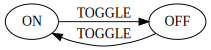
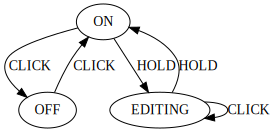
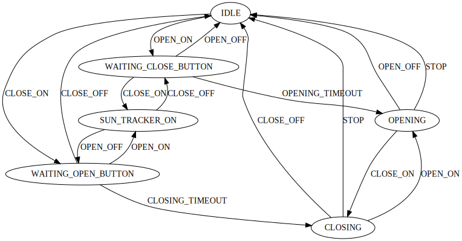

# ESPHome State Machine
A flexible [Finite-State Machine](https://en.wikipedia.org/wiki/Finite-state_machine) platform for [ESPHome](https://esphome.io/). It lets you model complex behaviours with limited inputs, such as:

* Controlling dimmable `light` with a single button.
* Controlling a garage door `cover` with a single button.
* Controlling a `display` with a button (e.g. flip through pages on click, and go into editing mode on hold).
* And more...

## Installing

```yaml
external_components:
  - source:
      type: git
      url: https://github.com/muxa/esphome-state-machine
```

## Configuration

The basic state machine configuration involves providing:

* A list of `states`
* A list of `inputs`
* A list of allowed `transitions` for each input.

Example for a simple on/off toggle state machine:



```yaml
state_machine:
  - name: On/Off Toggle State Machine
    states:
      - "OFF"
      - "ON"
    inputs:
      - name: TOGGLE
        transitions:
          - ON -> OFF
          - OFF -> ON
```

And to transition between states it you'll need to trigger the machine by providing input, e.g:

```yaml
binary_sensor:
  - platform: gpio
    pin: D6
    name: "Button"
    filters:
      - delayed_on: 100ms
    on_press:
      - state_machine.transition: TOGGLE
```

## Configuration variables:

* **initial_state** (**Optional**, string): The intial state of the state machine. Defaults to first defined state.
* **states** (**Required**, list): The list of states that the state machine has.

  * **name** (**Required**, string): The name of the state. Must not repeat.
  * **on_enter** (*Optional*, [Automation](https://esphome.io/guides/automations.html#automation)): An automation to perform when entering this state. 
  * **on_leave** (*Optional*, [Automation](https://esphome.io/guides/automations.html#automation)): An automation to perform when leaving this state. It called before `on_enter` of the next state.
  * **on_set** (*Optional*, [Automation](https://esphome.io/guides/automations.html#automation)): An automation to perform when setting this state using `set` action or via `initial_state`. Will not trigger if new state is the same as current state.

* **inputs** (**Required**, list): The list of inputs that the state machine supports with allowed state transitions.

  * **name** (**Required**, string): The name of the input. Must not repeat.
  * **transitions** (**Required**, list): The list of allowed transitions. Short form is `FROM_STATE -> TO_STATE`, or advanced configuration:
    * **from** (**Required**, string): Source state that this input is allowed on.
    * **to** (**Required**, string): Target state that this input transitions to.
    * **action** (*Optional*, [Automation](https://esphome.io/guides/automations.html#automation)): An automation to perform when transition is performed. 
  * **action** (*Optional*, [Automation](https://esphome.io/guides/automations.html#automation)): An automation to perform when transition is done by this input. This action is performed after transition-specific action. 

* **diagram** (*Optional*, boolean): If true, then a diagram of the state machine will be ouput to the console during validation/compilation of YAML. See **Diagrams** section below for more details. Defaults to `false`.

> ### Note:
>
> Any running state machine automations (state, input and transition) will be stopped before running next automations. This is useful when there's a delayed transition in one of the automation and it needs to be cancelled because a new input was provided which results in a different transition. 

## `state_machine.transition` Action

You can provide input to the state machine from elsewhere in your WAML file with the `state_machine.transition` action.
```yaml
# in some trigger
on_...:
  # Basic:
  - state_machine.transition: TOGGLE

  # Advanced (if you have multiple state machines in one YAML)
  - state_machine.transition:
      id: sm1
      input: TOGGLE
```

Configuration options:

* **id** (*Optional*, [ID](https://esphome.io/guides/configuration-types.html#config-id)): The ID of the state machine.
* **input** (**Required**, string): The input to provide in order to transition to the next state.

## `state_machine.set` Action

This action allows resetting the state machine current state, without going through transitions. This can be useful when initial state is not really known until some sensor data is available. 

> Note that only the target state `on_set` automation will be triggered, and all other state machine automations (`on_enter`, `on_leave` and `action` of the inputs and transitions) will be skipped.

```yaml
# in some trigger
on_...:
  # Basic:
  - state_machine.set: OPEN

  # Advanced (if you have multiple state machines in one YAML)
  - state_machine.set:
      id: sm1
      state: OPEN
```

Configuration options:

* **id** (*Optional*, [ID](https://esphome.io/guides/configuration-types.html#config-id)): The ID of the state machine.
* **state** (**Required**, string): The state to set state machine to bypassing transitions.

## `state_machine.transition` Condition

This condition lets you check what transition last occurred.

```yaml
# in some trigger
on_...:
  # Basic
  if:
    condition:
      state_machine.transition:
        trigger: TOGGLE
    then:
      - logger.log: Toggled

  # Advanced
  if:
    condition:
      state_machine.transition:
        id: sm1
        from: "OFF"
        trigger: TOGGLE
        to: "ON"
    then:
      - logger.log: Turned on by toggle
```

## `text_sensor.state_machine` Sensor

This is a simple text sensor to expose the current state of the state machine:

```yaml
text_sensor:
  - platform: state_machine
    name: On/Off Toggle State
```

* **state_machine_id** (*Optional*, [ID](https://esphome.io/guides/configuration-types.html#config-id)): The ID of the state machine.
* All other options from [Text Sensor](https://esphome.io/components/text_sensor/index.html).

## Diagrams

You have an option to generate a diagram of the state machine. You can enable this by adding `diagram: true` to the state machine yaml declaration (disabled by default).

When compiling or validating your YAML a state machine diagram will be output to the console, in a form of:

* A URL of the diagram image in SVG format
* The "source code" of the diagram in [DOT language](https://en.wikipedia.org/wiki/DOT_(graph_description_language))

Here's an example:

```
INFO State Machine Diagram (for On/Off Toggle State Machine):
https://quickchart.io/graphviz?format=svg&graph=digraph%20%22On/Off%20Toggle%20State%20Machine%22%20%7B%0A%20%20node%20%5Bshape%3Dellipse%5D%3B%0A%20%20ON%20-%3E%20OFF%20%5Blabel%3DTOGGLE%5D%3B%0A%20%20OFF%20-%3E%20ON%20%5Blabel%3DTOGGLE%5D%3B%0A%7D

INFO DOT language graph:
digraph "On/Off Toggle State Machine" {
  node [shape=ellipse];
  ON -> OFF [label=TOGGLE];
  OFF -> ON [label=TOGGLE];
}
``` 

To get just the url use this command:

```bash
esphome config <config.yaml> 2>&1 | grep quickchart.io
```

To open the diagram in Chrome use this command:

```bash
esphome config <config.yaml> 2>&1 | grep quickchart.io | xargs open -n -a "Google Chrome" --args "-0"
```

> To get a PNG image instead of SVG change the `format` parameter in the image url from `svg` to `png`.

## All Examples

### Simple Toggle


This example illustrates toggling an LED using a button.

See [toggle-example.yaml](toggle-example.yaml).

### Button Controlled Dimmable Light



This example models a single button control for a dimmable light with the following functionality:
* CLICK to toggle ON of OFF
* HOLD to go into EDITING mode to adjust brightness with a CLICK.

See [dimmable-light-example.yaml](dimmable-light-example.yaml).

### Dual Switch Cover Control



This example demonstrates using 2 switches to control a time-based cover:
* Switch 1 ON: OPEN
* Switch 2 ON: CLOSE
* Both switches ON: enable Sun Tracker

See [dual-switch-cover-example.yaml](dual-switch-cover-example.yaml).
