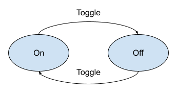
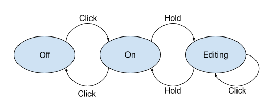

# esphome-state-machine
[State Machine](https://en.wikipedia.org/wiki/Finite-state_machine) implemented using text_sensor.

## Installing

```yaml
external_components:
  - source:
      type: git
      url: https://github.com/muxa/esphome-state-machine
      ref: dev
```

## Configuration

The basic state machine configuration involves providing:

* A list of `states`
* A list of `inputs`
* A list of allowed `transitions` for each input.

Example for a simple on/off toggle state machine:



```yaml
text_sensor:
  - platform: state_machine
    name: On/Off Toggle State Machine
    initial_state: OFF
    states:
      - OFF
      - ON
    inputs:
      - name: TOGGLE
        transitions:
          - ON -> OFF
          - OFF -> NO
```

And to use it you'll need to provide some input, e.g:

```yaml
binary_sensor:
  - platform: gpio
    pin: D6
    name: "Button"
    filters:
      - delayed_on: 100ms
    on_press:
      - state_machine.transition: TOGGLE
```

## Configuration variables:

* **initial_state** (**Required**, string): The intial state of the state machine.
* **states** (**Required**, list): The list of states that the state machine has.

  * **name** (**Required**, string): The name of the state. Must not repeat.
  * **on_enter** (*Optional*, [Automation](https://esphome.io/guides/automations.html#automation)): An automation to perform when entering this state. Note that any running state atuomations will be stopeed.
  * **on_leave** (*Optional*, [Automation](https://esphome.io/guides/automations.html#automation)): An automation to perform when leaving this state. Note that any running state atuomations will be stopeed.

* **inputs** (**Required**, list): The list of inputs that the state machine supports with allowed state transitions.

  * **name** (**Required**, string): The name of the input. Must not repeat.
  * **transitions** (**Required**, list): The list of allowed transitions. Short form is `FROM_STATE -> TO_STATE`, or advanced configuration:
    * **from** (**Required**, string): Source state that this input is allowed on.
    * **to** (**Required**, string): Target state that this input transitions to.
    * **action** (*Optional*, [Automation](https://esphome.io/guides/automations.html#automation)): An automation to perform when transition is performed.
  * **action** (*Optional*, [Automation](https://esphome.io/guides/automations.html#automation)): An automation to perform when transition is done by this input. This action is performed after transition-specific action.

## `state_machine.transition` Action

You can provide input to the state machine from elsewhere in your WAML file with the `state_machine.transition` action.
```yaml
# in some trigger
on_...:
  # Basic:
  - state_machine.transition: TOGGLE

  # Advanced (if you have multiple state machines in one YAML)
  - state_machine.transition:
      id: sm1
      input: TOGGLE
```

Configuration options:

* **id** (*Optional*, [ID](https://esphome.io/guides/configuration-types.html#config-id)): The ID of the state machine.
* **input** (**Required**, string): The input to provide in order to transition to the next state.

## `state_machine.transition` Condition

This confition lets you check what transition last occurred.

```yaml
# in some trigger
on_...:
  # Basic
  if:
    condition:
      state_machine.transition:
        trigger: TOGGLE
    then:
      - logger.log: Toggled

  # Advanced
  if:
    condition:
      state_machine.transition:
        id: sm1
        from: OFF
        trigger: TOGGLE
        to: ON
    then:
      - logger.log: Turned on by toggle
```

## More examples

### Button Controlled Dimmable Light



This example models a single button control for a dimmable light with the following functionality:
* CLICK to toggle ON of OFF
* HOLD to go into EDITING mode to adjust brightness with a CLICK.

See [dimmable_light_example.yaml](dimmable_light_example.yaml).

